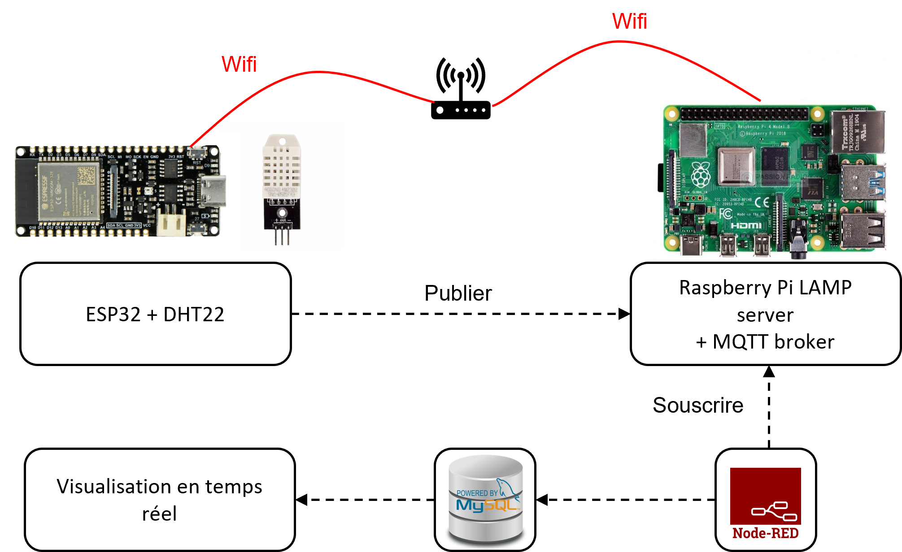

# Remontée de données (température et humidité) en temps réel

Ce projet a été récemment achevé le 10 juin 2023. Il s'agit d'un système qui a été réalisé au sein de l'école universitaire de physique et d'ingénierie. Pendant celui-ci, ma mission était de collecter, afficher et stocker les données d'une ruche d'abeilles pour une utilisation ultérieure, à travers le protocole MQTT.

# Vidéo de démonstration à venir

Je prévois de créer une vidéo détaillée qui explique le fonctionnement complet du système d'ici le 15 juillet. Cette vidéo fournira une démonstration pas à pas et mettra en évidence les fonctionnalités clés du projet.